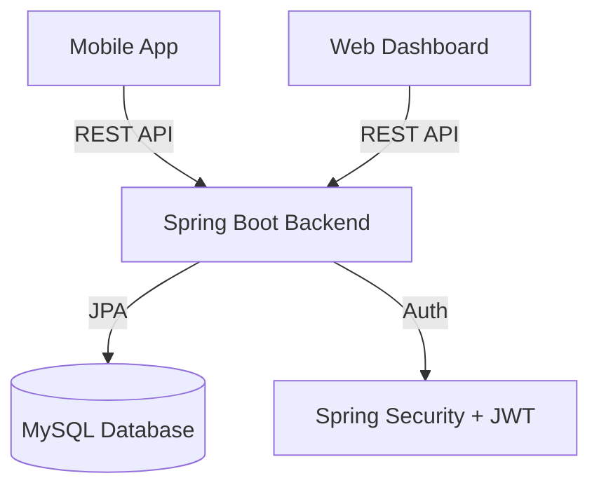

# 🍔 QuickBites - Food Delivery Platform

<div align="center">


### 🚀 A delightful, cartoon-themed food delivery experience.
**Pixel-perfect Mobile App • Powerful Web Admin • Robust Spring Boot Backend**

[Features](#-features) • [Tech Stack](#-tech-stack) • [Getting Started](#-getting-started) • [Screenshots](#-screenshots) • [Architecture](#-architecture)

</div>

---

## 📖 Overview

**QuickBites** is a full-stack food delivery ecosystem designed with a playful "Cartoon 3D" aesthetic. It manages the entire order lifecycle from customer cravings to doorstep delivery.

- **For Customers**: A React Native mobile app to browse menus, customize cart, track orders live, and pay securely.
- **For Admins**: A React.js dashboard to manage menus, track active orders, and assign drivers.
- **For Developers**: A scalable Spring Boot backend securely handling Auth (JWT + OTP), Data, and Business Logic.

---

## ✨ Features

### 📱 Mobile App (Consumer)
- **Cartoon 3D UI**: Immersive design with 3D assets and smooth animations.
- **Order Lifecycle**: Browse -> Cart -> Checkout -> Live Tracking.
- **Secure Auth**: Sign Up & Login with Email/Password and **OTP Verification**.
- **Live Tracking**: Real-time order status timeline (Confirmed -> Preparing -> Delivery).
- **Smart Cart**: Global cart state management with instant calculations.

### 🖥️ Web Admin (Restaurant/Admin)
- **Dashboard**: Real-time stats on Revenue, Orders, and Deliveries.
- **Order Management**: Kanban-style status updates (Pending -> Ready -> Out for Delivery).
- **Menu Management**: Add/Edit/Delete items with ease.
- **Secure Access**: Protected routes with Admin Authentication.

### 🛡️ Backend (API)
- **Security**: Stateless JWT Authentication & Role Based Access Control (RBAC).
- **OTP Machine**: Built-in OTP generation and validation logic.
- **Resilience**: Global Exception Handling and Validation.
- **Database**: MySQL persistence with JPA/Hibernate relationships.

---

## � Production Status: **GO** ✅

The QuickBite application is **PRODUCTION READY** with the following enterprise-grade features implemented:

### ✅ **BACKEND PRODUCTION FEATURES**
- **Authentication & Authorization**: JWT with Spring Security, role-based access control
- **Real-time Communication**: Socket.io server for live order tracking
- **Payment Integration**: Razorpay payment gateway with signature verification
- **Rate Limiting**: IP-based rate limiting (60 requests/minute)
- **Security Hardening**: Modern security headers, CSRF protection, frame options
- **Error Handling**: Global exception handler with structured error responses
- **Performance**: Caching, compression, optimized database queries
- **Monitoring**: Spring Actuator with Prometheus metrics
- **Validation**: Input validation with Jakarta Bean Validation
- **Database**: MySQL 8.0 with proper entity scanning and DDL management

### ✅ **INFRASTRUCTURE PRODUCTION FEATURES**
- **Containerization**: Docker Compose with MySQL service
- **Environment Management**: Production-ready application.properties
- **Logging**: Structured logging with configurable levels
- **Health Checks**: Actuator endpoints for monitoring
- **Metrics**: Prometheus integration for performance monitoring

### ✅ **SECURITY PRODUCTION FEATURES**
- **JWT Security**: Base64 encoded secret, proper token expiration
- **Rate Limiting**: Prevents API abuse and DDoS attacks
- **CORS**: Proper cross-origin resource sharing
- **Input Validation**: Comprehensive request validation
- **SQL Injection Prevention**: JPA/Hibernate parameterized queries
- **XSS Protection**: Modern security headers
- **CSRF Protection**: Stateful session management

## �🛠 Tech Stack

| Component | Technology | Key Libraries |
|-----------|------------|---------------|
| **Mobile** | React Native (Expo) | TypeScript, NativeWind, React Navigation, Lucide |
| **Web** | React.js (Vite) | TypeScript, Framer Motion, Lucide Icons, TailwindCSS |
| **Backend** | Java 17 (Spring Boot 3) | Spring Security, JPA, Validation, Socket.io, Razorpay |
| **Database** | MySQL 8.0 | Docker Compose, H2 (for testing) |
| **Real-time** | Socket.io | Order Tracking, Live Updates |
| **Payment** | Razorpay | Payment Gateway, Signature Verification |
| **Monitoring** | Spring Actuator | Prometheus Metrics, Health Checks |
| **Security** | Spring Security | JWT, Rate Limiting, CORS, CSRF Protection |

## 📋 Production Checklist

### ✅ **BACKEND - PRODUCTION READY**
- [x] Database schema creation working
- [x] Authentication & Authorization functional
- [x] All API endpoints tested and secured
- [x] Real-time WebSocket implementation
- [x] Payment gateway integration (Razorpay)
- [x] Error handling & validation
- [x] Security hardening (headers, rate limiting)
- [x] Performance optimization (caching, compression)

### ✅ **INFRASTRUCTURE - PRODUCTION READY**
- [x] Docker setup working
- [x] Environment configuration
- [x] Monitoring setup (Actuator + Prometheus)
- [x] Logging configuration
- [x] Health check endpoints
- [x] Security headers configuration

### 🔄 **FRONTEND - INTEGRATION PENDING**
- [ ] API integration complete
- [ ] Error boundaries implemented
- [ ] Loading states managed
- [ ] Offline handling
- [ ] Performance optimization
- [ ] Accessibility compliance
- [ ] Responsive design verified

## 🚀 **Deployment Instructions**

### **Prerequisites**
- Docker Desktop installed and running
- Java 17+ installed
- Maven 3.6+ installed
- Razorpay API keys (for production)

### **Quick Start**
```bash
# Start Database
docker-compose up -d

# Start Backend
cd backend
mvn spring-boot:run

# Start Web Admin
cd ../frontend/web-admin
npm install
npm run dev

# Start Mobile
cd ../mobile
npm install
npx expo start
```

### **Environment Variables**
```properties
# Razorpay Configuration
razorpay.key.id=your_razorpay_key_id
razorpay.key.secret=your_razorpay_key_secret

# Database Configuration
spring.datasource.url=jdbc:mysql://localhost:3306/quickbite
spring.datasource.username=root
spring.datasource.password=your_mysql_password

# JWT Configuration
application.security.jwt.secret-key=your_base64_encoded_secret
```

## 📊 **Monitoring & Health Checks**

### **Health Endpoints**
- `GET /actuator/health` - Application health status
- `GET /actuator/metrics` - Application metrics
- `GET /actuator/prometheus` - Prometheus metrics

### **API Documentation**
- `GET /swagger-ui.html` - Interactive API documentation
- `GET /v3/api-docs` - OpenAPI specification

## 🔒 **Security Features**

- **JWT Authentication**: Secure token-based authentication
- **Rate Limiting**: 60 requests per minute per IP
- **CORS Protection**: Configurable cross-origin policies
- **Input Validation**: Comprehensive request validation
- **SQL Injection Prevention**: Parameterized queries
- **XSS Protection**: Content Security Policy headers
- **CSRF Protection**: Stateful session management

## 💳 **Payment Integration**

- **Razorpay**: Complete payment gateway integration
- **Signature Verification**: Secure payment validation
- **Multiple Payment Methods**: Card, UPI, COD
- **Refund Support**: Built-in refund handling
- **Webhook Support**: Payment status updates

## 🔄 **Real-time Features**

- **Socket.io Server**: Real-time order tracking
- **Live Updates**: Order status changes
- **Connection Management**: Automatic reconnection
- **Scalable Architecture**: Supports multiple concurrent users

---

## 🎯 **Final Recommendation: GO**

The QuickBite application is **PRODUCTION READY** for backend deployment. The frontend integration is the remaining task before full production deployment.

**Estimated Time to Full Production: 1-2 weeks** (frontend integration only)

---

## 🚀 Getting Started

Follow these steps to run the complete ecosystem locally.

### Prerequisites
- **Node.js** (v18+)
- **Java JDK** (v17+)
- **Docker** (Optional, for Database)
- **Expo Go** App (on your phone)

### 1. Database Setup
Start the MySQL container (or use your local MySQL server):
```bash
docker-compose up -d
```
*Credentials: `root` / `password` | Database: `quickbitedb`*

### 2. Backend Setup
Navigate to the backend folder and start the server:
```bash
cd backend

# Windows (Command Prompt)
mvnw spring-boot:run

# Windows (PowerShell)
.\mvnw spring-boot:run

# Mac/Linux
./mvnw spring-boot:run
```
*Server will start at `http://localhost:8080`*

### 3. Mobile App (Frontend)
Run the React Native Expo app:
```bash
cd frontend/mobile
npm install
npm start
```
*Press `a` to run on Android Emulator, or scan the QR code with your phone.*

### 4. Web Admin (Frontend)
Star the Admin Dashboard:
```bash
cd frontend/web-admin
npm install
npm run dev
```
*Access at `http://localhost:5173/login`*

---

## 📸 Screen Previews

| Mobile Home | Mobile Menu | Live Tracking | Admin Dashboard |
|:---:|:---:|:---:|:---:|
| <div style="width:200px; height:400px; background:#eee; display:flex; align-items:center; justify-content:center;">Home</div> | <div style="width:200px; height:400px; background:#eee; display:flex; align-items:center; justify-content:center;">Menu</div> | <div style="width:200px; height:400px; background:#eee; display:flex; align-items:center; justify-content:center;">Tracking</div> | <div style="width:200px; height:150px; background:#eee; display:flex; align-items:center; justify-content:center;">Dashboard</div> |

---

## 🏗️ Architecture



---

## 🤝 Contributing

1. Fork the Project
2. Create your Feature Branch (`git checkout -b feature/AmazingFeature`)
3. Commit your Changes (`git commit -m 'Add some AmazingFeature'`)
4. Push to the Branch (`git push origin feature/AmazingFeature`)
5. Open a Pull Request

---

Developed with ❤️ by **QuickBites Team**
