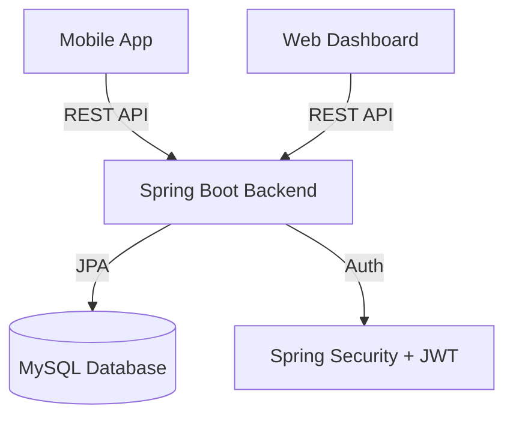

# 🍔 QuickBites - Food Delivery Platform

<div align="center">


### 🚀 A delightful, cartoon-themed food delivery experience.
**Pixel-perfect Mobile App • Powerful Web Admin • Robust Spring Boot Backend**

[Features](#-features) • [Tech Stack](#-tech-stack) • [Getting Started](#-getting-started) • [Screenshots](#-screenshots) • [Architecture](#-architecture)

</div>

---

## 📖 Overview

**QuickBites** is a full-stack food delivery ecosystem designed with a playful "Cartoon 3D" aesthetic. It manages the entire order lifecycle from customer cravings to doorstep delivery.

- **For Customers**: A React Native mobile app to browse menus, customize cart, track orders live, and pay securely.
- **For Admins**: A React.js dashboard to manage menus, track active orders, and assign drivers.
- **For Developers**: A scalable Spring Boot backend securely handling Auth (JWT + OTP), Data, and Business Logic.

---

## ✨ Features

### 📱 Mobile App (Consumer)
- **Cartoon 3D UI**: Immersive design with 3D assets and smooth animations.
- **Order Lifecycle**: Browse -> Cart -> Checkout -> Live Tracking.
- **Secure Auth**: Sign Up & Login with Email/Password and **OTP Verification**.
- **Live Tracking**: Real-time order status timeline (Confirmed -> Preparing -> Delivery).
- **Smart Cart**: Global cart state management with instant calculations.

### 🖥️ Web Admin (Restaurant/Admin)
- **Dashboard**: Real-time stats on Revenue, Orders, and Deliveries.
- **Order Management**: Kanban-style status updates (Pending -> Ready -> Out for Delivery).
- **Menu Management**: Add/Edit/Delete items with ease.
- **Secure Access**: Protected routes with Admin Authentication.

### 🛡️ Backend (API)
- **Security**: Stateless JWT Authentication & Role Based Access Control (RBAC).
- **OTP Machine**: Built-in OTP generation and validation logic.
- **Resilience**: Global Exception Handling and Validation.
- **Database**: MySQL persistence with JPA/Hibernate relationships.

---

## 🛠 Tech Stack

| Component | Technology | Key Libraries |
|-----------|------------|---------------|
| **Mobile** | React Native (Expo) | TypeScript, NativeWind, React Navigation, Lottie |
| **Web** | React.js (Vite) | TypeScript, Lucide Icons, Vanilla CSS System |
| **Backend** | Java 17 (Spring Boot 3) | Spring Security, JPA, Lombok, JJWT |
| **Database** | MySQL 8.0 | Docker Compose |

---

## 🚀 Getting Started

Follow these steps to run the complete ecosystem locally.

### Prerequisites
- **Node.js** (v18+)
- **Java JDK** (v17+)
- **Docker** (Optional, for Database)
- **Expo Go** App (on your phone)

### 1. Database Setup
Start the MySQL container (or use your local MySQL server):
```bash
docker-compose up -d
```
*Credentials: `root` / `password` | Database: `quickbitedb`*

### 2. Backend Setup
Navigate to the backend folder and start the server:
```bash
cd backend

# Windows (Command Prompt)
mvnw spring-boot:run

# Windows (PowerShell)
.\mvnw spring-boot:run

# Mac/Linux
./mvnw spring-boot:run
```
*Server will start at `http://localhost:8080`*

### 3. Mobile App (Frontend)
Run the React Native Expo app:
```bash
cd frontend/mobile
npm install
npm start
```
*Press `a` to run on Android Emulator, or scan the QR code with your phone.*

### 4. Web Admin (Frontend)
Star the Admin Dashboard:
```bash
cd frontend/web-admin
npm install
npm run dev
```
*Access at `http://localhost:5173/login`*

---

## 📸 Screen Previews

| Mobile Home | Mobile Menu | Live Tracking | Admin Dashboard |
|:---:|:---:|:---:|:---:|
| <div style="width:200px; height:400px; background:#eee; display:flex; align-items:center; justify-content:center;">Home</div> | <div style="width:200px; height:400px; background:#eee; display:flex; align-items:center; justify-content:center;">Menu</div> | <div style="width:200px; height:400px; background:#eee; display:flex; align-items:center; justify-content:center;">Tracking</div> | <div style="width:200px; height:150px; background:#eee; display:flex; align-items:center; justify-content:center;">Dashboard</div> |

---

## 🏗️ Architecture



---

## 🤝 Contributing

1. Fork the Project
2. Create your Feature Branch (`git checkout -b feature/AmazingFeature`)
3. Commit your Changes (`git commit -m 'Add some AmazingFeature'`)
4. Push to the Branch (`git push origin feature/AmazingFeature`)
5. Open a Pull Request

---

Developed with ❤️ by **QuickBites Team**
